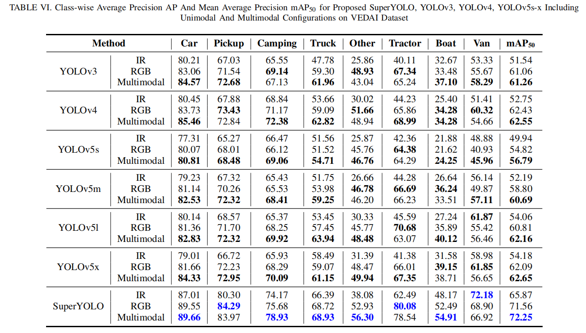

## Pretrained Checkpoints

## Requirements

```python
pip install -r requirements.txt
```

## Train

### 1. Prepare training data 

- 1.1 In order to realize the SR assisted branch, the input images of the network are downsampled from $1024 \times 1024$ size to $512 \times 512$ during the training process. Whereas in the test process, the size of the image is $512 \times 512$ direct, which is consistent with the input of other algorithms compared.

- 1.2 Download VEDAI data for our experiment from [baiduyun](https://pan.baidu.com/s/1C9yfcYfCaBb6vNtGSkjHFA), code: rqfx

- 1.3 Note that we transform the labels of the dataset to be horizontal boxes by [transform code](data/transform.py).You shoud run transform.py before training the model.

### 2. Begin to train

```python
python train_up.py --cfg models/SRyolo_noFocus.yaml --super --train_img_size 1024 --hr_input --data data/SRvedai.yaml --ch 4
```

## Test

```python
python test.py --weights runs/train/exp/best.pt --input_mode RGB+IR 
```

## Results

<p align="center">  </p>

## Visualization of results

<p align="center">  </p>


## Citation


## Acknowledgements
This code is built on [YOLOv5 (PyTorch)](https://github.com/ultralytics/yolov5). We thank the authors for sharing the codes.